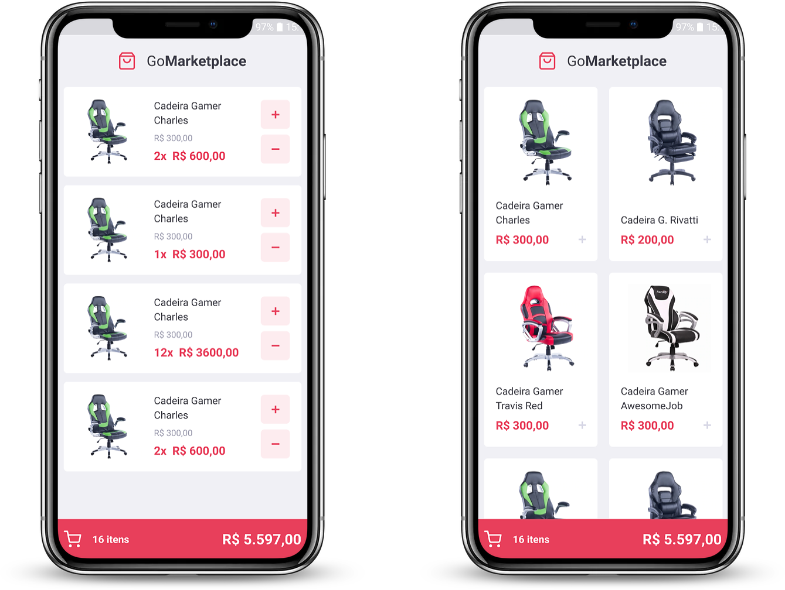

<!-- Logotipo -->
<h1 align="center" style="padding: 50px;">

</h1>

<div align="center">

<!-- Badges -->


<!-- Menu -->
<p align="center" >
  <a href="#bookmark_tabs-about-the-project">:bookmark_tabs:&nbsp;&nbsp;About the project</a>&nbsp;&nbsp;&nbsp;|&nbsp;&nbsp;&nbsp;
  <a href="#rocket-technologies">:rocket:&nbsp;&nbsp;Technologies</a>&nbsp;&nbsp;&nbsp;|&nbsp;&nbsp;&nbsp;
  <a href="#information_source-how-to-use">:information_source:&nbsp;&nbsp;How To Use</a>
</p>

<!-- Mockup -->
<div  align="center" style="padding: 50px;">
  
</div>

</div>

<!-- About -->
## :bookmark_tabs: About the project

Application that simulate a store online where we added products and we have the shopping cart control.

<!-- Technologies -->
## :rocket: Technologies

This project was developed at the [RocketSeat GoStack Bootcamp](https://rocketseat.com.br/bootcamp) with the following technologies:


- [React Native](https://reactnative.dev/)
- [React Navigation](https://reactnavigation.org/)
- [Styled Components](https://styled-components.com/)
- [React Icons](https://react-icons.github.io/react-icons/)
- [JSON Serve](https://www.npmjs.com/package/json-server)
- [Axios](https://github.com/axios/axios)
- [Jest](https://jestjs.io/)


<!-- How to use -->
## :information_source: How To Use


To clone and run this application, you'll need [Git](https://git-scm.com), [Node.js v10.16][nodejs] or higher + [Yarn v1.13][yarn] or higher installed on your computer. Run from your command line:

```bash
# Clone this repository
$ git clone git@github.com:KaiqueCovo/GoMarketplace.git

# Go into the repository
$ cd GoMarketplace

# Install dependencies
$ yarn install

# Run tests
$ yarn test

# Run Fake API
$ yarn json-server server.json -p 3333

# Run the app (iOS)
$ yarn ios

# Run the app (Android)
$ yarn android
```

---
Made with ♥  by [Kaique Covo](https://www.linkedin.com/in/kaique-covo-a46331147/) :wave:
